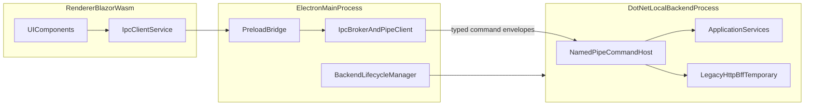

# Electron + Blazor + .NET Local Backend Migration Plan

## Goals And Constraints
- Target runtime: **desktop-first** with Electron launching and supervising a local .NET backend process.
- UI runtime stays **Blazor WebAssembly**.
- App contract becomes **typed IPC commands over native pipes** (no HTTP for desktop runtime).
- Existing `/api/*` HTTP BFF remains **temporarily** as a dual-stack fallback during phased migration.
- Keep clean separation of concerns, accessibility, and consistent project conventions.

## Current Baseline (What We Will Refactor)
- Blazor client currently calls HTTP directly via [`GodotGenerator.Blazor/GodotGenerator.Blazor.Client/Services/GodotGeneratorHttpClient.cs`](GodotGenerator.Blazor/GodotGenerator.Blazor.Client/Services/GodotGeneratorHttpClient.cs).
- Electron shell is present but thin in [`electron/main.cjs`](electron/main.cjs) and [`electron/preload.cjs`](electron/preload.cjs), currently loading a URL and exposing limited dialog APIs.
- Server host registers MVC controllers in [`GodotGenerator.Blazor/GodotGenerator.Blazor/Program.cs`](GodotGenerator.Blazor/GodotGenerator.Blazor/Program.cs).

## Target Architecture

## Workstreams

### 1) Contract-First IPC Foundation
- Define versioned command envelope and response envelope (correlation id, command name, payload, error, telemetry metadata).
- Introduce shared contracts project for desktop command DTOs (separate from HTTP DTO coupling).
- Add strict serialization rules (camelCase, explicit null handling, bounded payload size).

Primary files to add/update:
- New: [`src/GodotGenerator.Desktop.Contracts/`](src/GodotGenerator.Desktop.Contracts/)
- New: [`src/GodotGenerator.Desktop.Contracts/Commands/*.cs`](src/GodotGenerator.Desktop.Contracts/Commands)
- New: [`src/GodotGenerator.Desktop.Contracts/Envelope/*.cs`](src/GodotGenerator.Desktop.Contracts/Envelope)

### 2) .NET Backend Pipe Host + Command Dispatcher
- Add a dedicated pipe host service in backend process with typed dispatcher mapping command names to use-case handlers.
- Keep handler logic thin; delegate to existing application services.
- Add cancellation, timeout, and safe exception mapping to typed error codes.
- Retain existing HTTP BFF endpoints during migration (feature flag / startup profile based).

Primary files:
- New: [`GodotGenerator.Blazor/GodotGenerator.Blazor/Infrastructure/DesktopIpc/`](GodotGenerator.Blazor/GodotGenerator.Blazor/Infrastructure/DesktopIpc)
- Update: [`GodotGenerator.Blazor/GodotGenerator.Blazor/Program.cs`](GodotGenerator.Blazor/GodotGenerator.Blazor/Program.cs)
- Optional split later: new worker host project if process isolation warrants separate executable.

### 3) Electron Main As Secure Broker + Process Supervisor
- Extend Electron main process to start/monitor/stop local backend process (health checks via pipe handshake, restart policy, graceful shutdown).
- Preload exposes only minimal, audited IPC methods (no raw filesystem/process APIs in renderer).
- Main process translates renderer IPC calls to backend pipe command calls.

Primary files:
- Update: [`electron/main.cjs`](electron/main.cjs)
- Update: [`electron/preload.cjs`](electron/preload.cjs)
- New: [`electron/backendLifecycle.cjs`](electron/backendLifecycle.cjs)
- New: [`electron/pipeBroker.cjs`](electron/pipeBroker.cjs)

### 4) Blazor Client Transport Abstraction (No Direct HTTP In Desktop Mode)
- Introduce `IGodotGeneratorClientTransport` abstraction.
- Implement:
  - `HttpBffTransport` (temporary fallback).
  - `ElectronIpcTransport` (primary for desktop).
- Refactor current `GodotGeneratorHttpClient` usage behind a façade service so pages/components remain stable.
- Gate transport selection by runtime detection (`window.godotElectron`) and config policy.

Primary files:
- Update: [`GodotGenerator.Blazor/GodotGenerator.Blazor.Client/Services/GodotGeneratorHttpClient.cs`](GodotGenerator.Blazor/GodotGenerator.Blazor.Client/Services/GodotGeneratorHttpClient.cs)
- New: [`GodotGenerator.Blazor/GodotGenerator.Blazor.Client/Services/Transport/IGodotGeneratorClientTransport.cs`](GodotGenerator.Blazor/GodotGenerator.Blazor.Client/Services/Transport/IGodotGeneratorClientTransport.cs)
- New: [`GodotGenerator.Blazor/GodotGenerator.Blazor.Client/Services/Transport/ElectronIpcTransport.cs`](GodotGenerator.Blazor/GodotGenerator.Blazor.Client/Services/Transport/ElectronIpcTransport.cs)
- Update: [`GodotGenerator.Blazor/GodotGenerator.Blazor.Client/Program.cs`](GodotGenerator.Blazor/GodotGenerator.Blazor.Client/Program.cs)
- Update: [`GodotGenerator.Blazor/GodotGenerator.Blazor/wwwroot/js/electronBridge.js`](GodotGenerator.Blazor/GodotGenerator.Blazor/wwwroot/js/electronBridge.js)

### 5) Incremental Endpoint-to-Command Migration
- Migrate features in vertical slices (config, preferences, keys, generation) from HTTP calls to typed commands.
- Keep dual-stack until parity tests pass.
- Remove per-feature HTTP dependency from client only after stable verification.

Suggested order:
1. Config read/write
2. Preferences
3. Key management
4. Generation routes

### 6) Reliability, Security, Accessibility, and DX
- Security: strict command whitelist, payload schema validation, no renderer access to Node APIs, no arbitrary command execution.
- Reliability: retries for transient pipe faults, bounded queue, circuit-breaker behavior and user-facing degraded-state messages.
- Accessibility/UI: transport errors surfaced through existing status/message components; preserve keyboard flows and screen-reader labels.
- Documentation comments: XML docs for contracts/handlers; concise in-code comments for non-obvious lifecycle logic.

### 7) Testing And Rollout Strategy
- Unit tests:
  - command dispatcher + handler mapping
  - Electron broker request/response mapping
  - client transport selection and fallback logic
- Integration tests:
  - end-to-end desktop command path (renderer -> preload -> main -> pipe -> backend)
  - dual-stack parity tests comparing HTTP and IPC outputs for same request fixtures
- Rollout phases:
  - Phase A: plumbing + dual-stack
  - Phase B: feature migration by slices
  - Phase C: default IPC in desktop
  - Phase D: deprecate HTTP in desktop path (retain only for web/test if required)

## Engineering Standards For This Migration
- Keep domain/application logic in existing .NET layers; transport layers only orchestrate and map contracts.
- Avoid leaking Electron details into UI components; isolate in transport services.
- Enforce consistent naming/versioning for commands (e.g., `Config.Get/v1`, `Generate.Text/v1`).
- Add concise XML summaries and targeted comments in lifecycle/concurrency code paths.
- Maintain backwards compatibility while dual-stack is active.

## Key Risks And Mitigations
- **Risk:** transport bifurcation complexity during dual-stack.
  - **Mitigation:** single client façade + shared response envelopes + parity tests.
- **Risk:** pipe protocol drift across layers.
  - **Mitigation:** shared contracts assembly + versioned command IDs + schema tests.
- **Risk:** Electron/backend lifecycle race conditions.
  - **Mitigation:** startup handshake, readiness timeout, and explicit shutdown contract.
